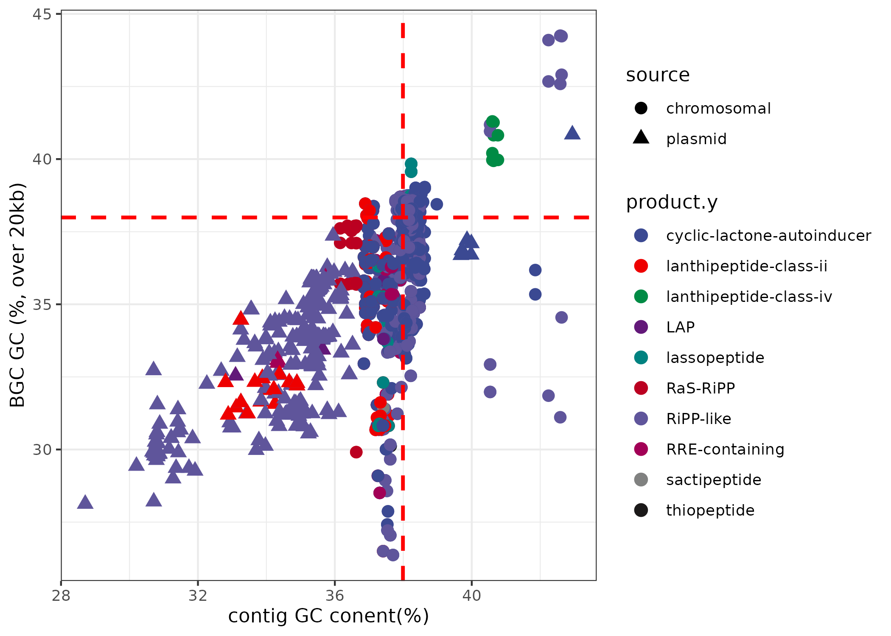

## smashGC
A tool that takes input of a folder containing gbff files (this can be multiple within the directory) and a single tsv file describing the biosynthetic gene clusters (BGC) regions within the genomes. The tool was built around correlating GC content of antismash BGCs with host GC content.

The tool then finds the GC content of the BGC vs the whole genome. 

The output is a plot of the correlation between the two GC content values created using this tool. Antismash was run on 616 enterococcal genomes and the tool was run on the genomes and a tsv file describing the products. 



## Features

- **BGC Prediction Correlation**: Correlates antiSMASH-predicted BGC's GC content with whole genome GC.

## Requirements

- Python 3.7.12
- antiSMASH (for generating initial data)
- Biopython

## Installation

1. Clone the repository to your local machine:
    ```bash
    git clone https://github.com/DEHourigan/smashGC.git
    ```
2. Navigate to the cloned directory:
    ```bash
    cd smashGC
    ```
3. Install the required dependencies:
    ```bash
    conda env create -f smashGC.yml
	conda activate smashGC
    ```

## Usage


1. Prepare your data:
    - Ensure your `.gbff` files are located within a single folder.
    - Create a `.tsv` file containing the headers `product`, `assembly`, `orig_start`, `orig_end`, `locus`, `filename` as described:
        - **product**: Predicted by antiSMASH. ie. lanthipeptide-i
        - **assembly**: Accession of the genome. 
        - **orig_start** and **orig_end**: antiSMASH regions in the context of the whole genome.
        - **locus**: Contig name
        - **filename**: Name of each individual `.gbff` file.

2. Run smashGC:
    ```bash
    python smashGC.py -f /path/to/folder -t /path/to/file.tsv
    ```

Replace `/path/to/folder` and `/path/to/file.tsv` with the actual paths to your `.gbff` files folder and `.tsv` file, respectively.

## Output

tsv file contiaining GC content of BGC vs genome. Can be plotted from here.

## Contributing

DEHourigan
 
## Contact

For any queries, please reach out via GitHub issues or directly to `114402828@umail.icc.ie`.

---

